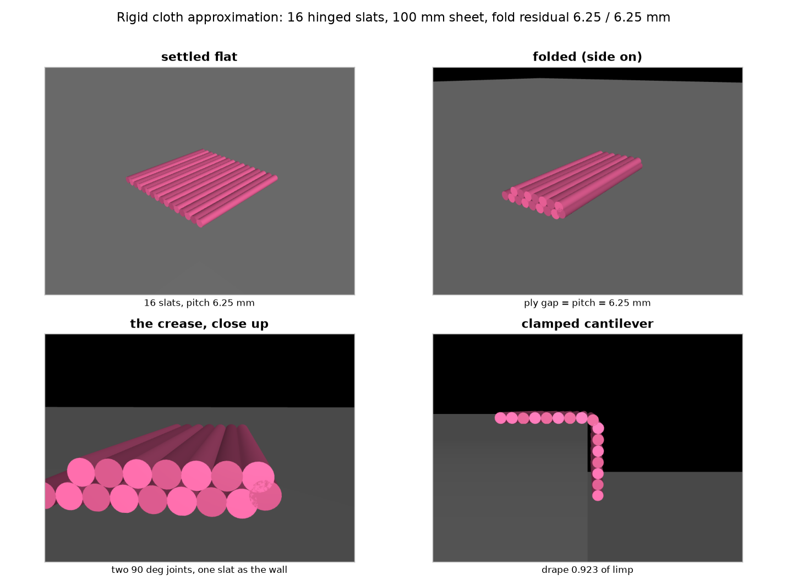
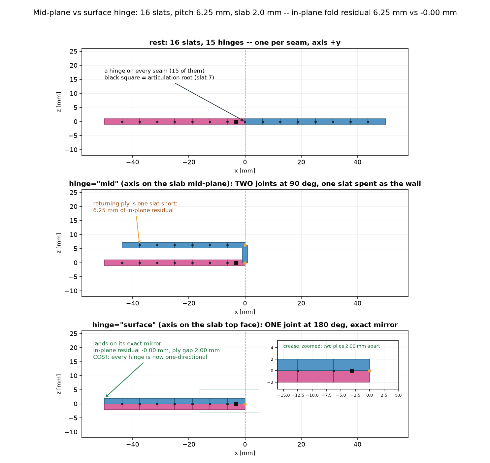
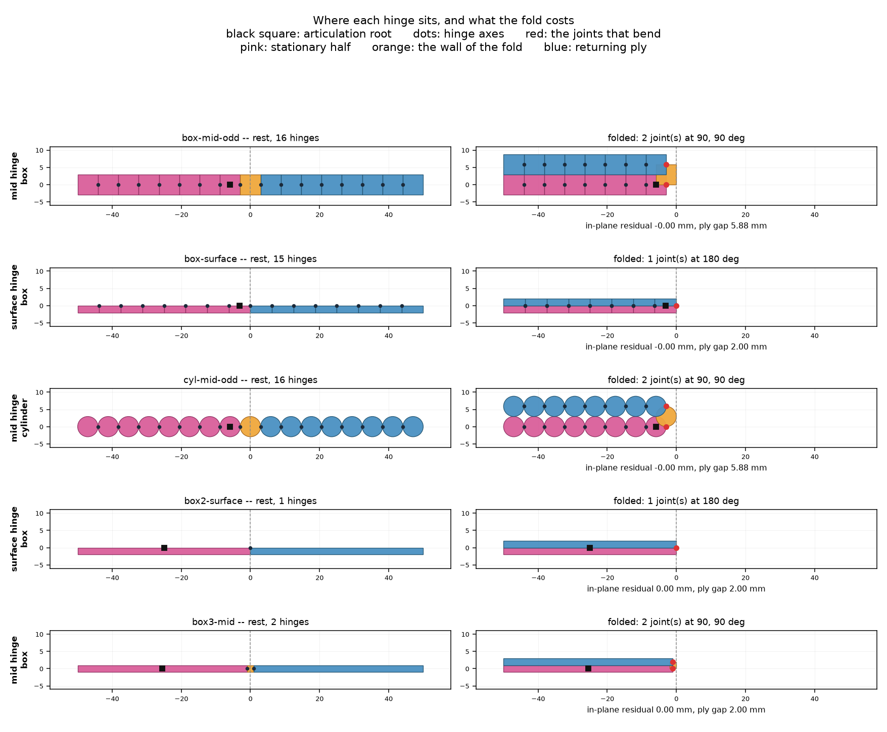
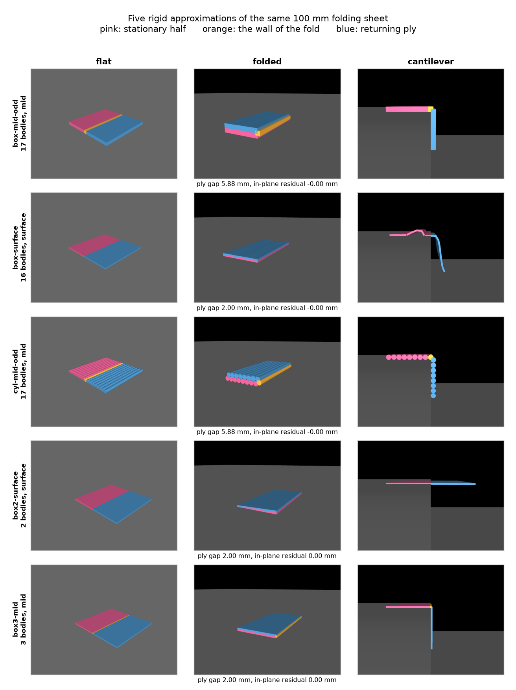

# Rigid approximation of the folding cloth: a hinged slat chain

**What it is.** `isaacsimenvs/tasks/cloth/utils/rigid_cloth.py` emits the sheet as an ordinary
articulation: `N` rigid slats, each spanning the sheet's full width in `y` and some width in `x`,
joined by revolute joints whose axis is `+y` — parallel to the crease. Free-floating base, rooted at
the last slat of the stationary half so each side hangs off the root as its own branch.

**Five variants of it are built and measured** — see *Five approximations* below, which is the
section to read first if you want the comparison rather than the derivation. `ChainSpec` takes a list
of slat widths, so both a uniform chain and a two-plate-plus-crease-bar chain are the same code.

**Why it exists.** `ClothEnv` simulates the sheet as a VBD particle cloth on a coupled MJWarp + VBD
solve, and that coupling *is* the cost of the task — at 80 VBD iterations ~96% of a step was VBD
work, and the cost model `ms/step ≈ 45.5 + 11.52 × iterations` is almost entirely that term. A
hinged chain is one MJWarp solve with no coupling, no proxy exchange and no particle self-contact.

**Status: all five are wired into the env and trained** — see *Built: all five are wired into the
env* below, and `rigid_cloth_rl_comparison.md` for what they learn and what transfers. Nothing in
`cloth_env.py` or `Cloth.yaml` changed; `RigidClothEnv` overrides six members of `ClothEnv`, of
which only the fold-target lift changes a scored quantity, and only for the mid-hinge chains.



Rendered by `scripts/analysis/rigid_cloth_render.py` (MuJoCo offscreen, OSMesa). What is drawn *is*
the collision hull — MuJoCo's URDF importer keeps collision geoms and discards visual ones, and the
URDF gives both the same shape on purpose. The fold panel is a three-quarter view because a pure
side view collapses every slat to a circle and the U becomes two rows of dots.

## The topology is 1-D, deliberately

A full 2-D grid of plates hinged in both directions is the obvious richer model and it fails twice:

* **It is not a tree.** Every 2×2 cell of plates closes a kinematic loop, which a URDF cannot
  express and an Isaac Lab `Articulation` cannot hold.
* **It would not bend anyway.** A developable quad mesh with creases in two directions is rigid —
  the standard rigid-origami result. The extra joints buy nothing and cost.

So the chain bends about `y` and is **rigid across its width**. That is the model's defining
limitation: it cannot drape over a fingertip, wrinkle diagonally, or be gathered. It can fold about
the crease, which is what the task scores.

## pitch, thickness and joint limit are one decision

Adjacent slats never collide (an articulation filters the parent–child contact pair), so the binding
constraint is slat `i` against slat `i+2`. With both intervening joints bent by `φ` their centres
are `pitch · |(½ + cos φ + ½cos 2φ, sin φ + ½sin 2φ)|` apart, which at `φ = 90°` is exactly `pitch`.
Hence:

    thickness  = pitch          (cylinder collider, radius pitch/2, lying along y)
    joint limit = 90°           `max_bend_for_thickness(pitch, pitch)` returns exactly π/2

Colliders are cylinders because two boxes hinged at their shared face interpenetrate at *any*
nonzero angle. A row of tubes is also the rigid analogue of the VBD sheet's own construction —
particles of radius 8 mm on a 16.7 mm grid are a row of spheres. Visual geometry is the same shape
as the collision geometry, on purpose; this task has already paid for a render that showed something
other than what was simulated.

## A rigid chain folds through an arc, not a reflection

`folded_joint_angles` is **two joints at 90°**, not one at 180°. One joint at 180° is the intuitive
answer and it is geometrically empty: the hinge is on the seam, so rotating a slat 180° about it
lands that slat exactly on top of its neighbour — coincident, not stacked, with zero lift.

Two right angles put one slat vertically as the wall of a U and the rest of the moving half flat on
top, which means **ply separation = the wall slat's width**, not any cloth thickness.

`fold_residual()` returns the miss, and it is the number the fold target must be built from.
`ClothEnv` already made the analogous mistake on the VBD sheet — lifting targets by
`2 × particle_radius` (16 mm) where cloth-on-cloth contact settles at 2.5 mm, so a perfect fold
scored 14 mm of error before the policy did anything.

### The wall has to come from somewhere, and that is what parity decides

> **Correction.** An earlier version of this document claimed the opposite of what follows — that
> even counts fold better and odd counts land *two* pitches short. That was an artefact of how the
> fold was derived, not a property of the model, and it is wrong. The text below replaces it.

The fold spends one slat standing vertically. **Which** slat is a free choice, and the earlier
version always took the first slat of the *moving* half — which removes it from that ply at any
parity, and so made the returning ply one slat short no matter what.

Choose the slat that straddles `x = 0` instead, and it belongs to neither ply, so both plies keep
their full length and the fold lands on its exact mirror. That slat exists only when the count is
**odd**:

| | crease at `x = 0` | wall comes from | in-plane residual |
|---|---|---|---|
| odd `N` (17) | inside a slat | that slat — free | **0.00 mm** |
| even `N` (16) | on a seam | the moving ply | 6.25 mm |

`root_slat` moved with it: the root is now the last slat of the *stationary* half, one inboard of the
wall, rather than the centre slat. Rooting *at* the wall would leave the root vertical in the folded
pose, so "root pose" would stop meaning "stationary half's frame" — the frame `_stationary_frame`
fits and the adapter reports — and every analytic comparison against the rest pose would need an
extra 90° rotation.

**The two hinge modes want opposite parity**, so there is no single right default and
`default_num_slats(hinge)` is the function that knows: a mid-plane fold wants a crease slat to spend
(odd), while a surface fold spends no slat but folds about a *seam*, which has to sit at `x = 0`
(even).

## Where to put the hinge axis: mid-plane or top surface



The residual above is a consequence of putting the axis on the slab's **mid-plane**. Raise it to the
slab's **top face** and the body hangs a half-thickness below its own axis, so a single joint at
180 degrees lands the child flat on the parent — touching, not coincident. No slat is spent as a
wall, and the fold becomes an exact reflection.

| | `hinge="mid"` | `hinge="surface"` |
|---|---|---|
| joints bent for a fold | 2 × 90° | **1 × 180°** |
| slat spent as the wall | one | **none** |
| in-plane fold residual | **0.00 mm** with an odd count; one pitch with an even one | **0.00 mm** |
| ply gap | the wall slat's width — free only if the wall is a separate bar | **slab thickness — free to choose (1–2 mm)** |
| bends both ways | **yes, symmetric ±90°** | no: every hinge is one-directional |
| drape, limits enforced | **0.942** | 0.166 |
| limit violation while draping | **0.0°** | 64.0° at default solver settings |

Both halves of that are measured. The fold is exact — `fold_residual` returns `(0, thickness)` for
every slat count and thickness tried, and the MuJoCo fold probe settles at a 1.92 mm ply gap against
a 2.00 mm prediction with the crease holding at 180.9°. And the ply gap stops being hostage to the
pitch, which is the bigger win: at 2 mm it is finally close to the VBD sheet's measured 2.5 mm,
where a mid-plane hinge is stuck at 6.25 mm unless you pay for more slats.

### The cost is real, and it was nearly missed

A surface hinge only works one way. The slab hangs below its axis, so one sense of rotation sweeps
it clear of its parent and the other drives it straight through — geometrically, *any* negative
angle penetrates by `thickness × sin θ`. The emitted limits are therefore one-sided and mirrored
across the root (`fold_direction`).

**The first measurement said the drape probe was unaffected (0.809), and that was wrong.** MuJoCo's
joint limits are soft, and for slats this short they leak badly: a slat of length `pitch` has a
gravitational angular acceleration of `3g/2L` = **2354 rad/s²** at 6.25 mm, which the default limit
solver cannot hold. Measured worst violation of a `[-180°, 0]` limit during the cantilever:

Sampled every 2 s out to 20 s, so that "settled" means settled rather than "looked quiet at 2 s".
Re-measured at the current probe defaults — the cloth-equivalent contact pairs, which is what the
env ships; the original sweep was run at `--friction 1.0 --no-pairs` and found more of these
settling than survive the correct friction:

| `solimp` dmax | `solref` timeconst | drape | settles? |
|---|---|---|---|
| 0.95 (default) | 0.02 (default) | 0.823 | **no — diverges at t = 2.29 s** |
| 0.95 | 0.002 | 0.727 | **no — diverges at t = 3.02 s** |
| **0.99** | **0.002** | **0.448** | **yes** |
| 0.999 | 0.002 | 0.166 | **no — diverges at t = 0.37 s** |
| 0.9999 | 0.002 | 0.107 | **no — chatters, joint speeds to 24 rad/s** |

Drape falls monotonically as the limit is actually enforced, which is the geometry asserting itself:
**a surface-hinge sheet cannot bend downward at all**, and the 0.823 at the default impedance is the
model quietly violating its own contract, with adjacent slats interpenetrating by ~0.8 × thickness.

**But the window has closed.** Exactly one row settles, and it is the row that neither enforces the
limit (0.448 of limp, so still leaking) nor tightens it enough to be correct. There is no longer a
setting at which the surface hinge is simultaneously correct, stable and at the right friction —
which is the same conclusion *Friction: the coefficient transfers* reaches from the other direction.
Depending on a one-row window is not depending on a window, and this is in a solver whose behaviour
here is *known*; MJWarp's is not. `box-surface` is measured, not recommended.

The mid-plane hinge is untouched by the entire sweep — drape 0.942 and **0.0°** violation at every
value, because nothing is ever resting on a limit.

### The full list of what a surface hinge costs

Ordered by how much they matter, and separated into measured and geometric.

1. **One-directional bending** (measured, above). The sheet can only ever curl one way. Two
   consequences beyond the drape number: a sheet that ends up **upside down cannot fold at all**,
   and an **S-fold is impossible** — folding in half and then folding the double back the other way
   needs both senses. A roll, or repeated folds in the same sense, is fine.
2. **It needs non-default solver settings to be correct** (measured). At MuJoCo's defaults the
   limit leaks 64° and the slats interpenetrate. `solimp` dmax must go to ~0.999. **That knob has to
   survive the Isaac Lab / Newton path to MJWarp, and that has not been checked** — if joint-limit
   impedance is not reachable there, the surface hinge is not usable in the task at all, and this is
   the first thing to verify before adopting it.
3. **Flat is a limit boundary, not the middle of the range** (measured). `qpos0 = 0` sits exactly on
   the limit, so at rest — the sheet's normal state for most of an episode — 14 of its 15 joints
   are permanently pressed against an active constraint: `nefc` 270 with 14 joint-limit constraints,
   against **zero** limit constraints for either mid-plane chain (`cyl-mid-odd` 136 rows,
   `box-mid-odd` 272). Permanently active rows, per env, and they sit at the boundary where a soft
   constraint is least well behaved.
4. **It forces box colliders, and boxes cost 40%** (measured). A surface hinge needs a flat face for
   the ply to land on. Isolating the two changes: mid+cylinder 57 000 steps/s, mid+box 34 900,
   surface+box 33 300 — so the slowdown is **entirely the collider shape**, not the hinge mode. A
   real cost, just an indirect one.
5. **The underside opens a notch when the sheet curves** (geometric). The top faces pivot about
   their shared edge and stay closed; the bottom face opens a V of `2 t sin(θ/2)` at every seam —
   0.52 mm at 15°/joint, 2.83 mm at 90°, for a 2 mm slab. A cylinder chain has no such gap. Minor
   against a fingertip, but it is on the convex side, which is the side that touches things.
6. **Thin slabs are worse colliders.** The freedom to pick a small thickness is the main prize, but
   a 1 mm box is easier to tunnel through than a 6.25 mm cylinder. Dropping from 5 cm is clean down
   to 0.5 mm (rest height tracks `t/2` exactly, spread 0.009 mm, no instability) — but that is a
   slow test, and a fast hand has not been tried.
7. **The model has a distinguished "up".** Which face carries the axis is baked into the URDF, and
   the permitted sense mirrors across the root, so the two branches are not interchangeable.

**One thing that is NOT a cost — but only above a body count.** At 16 slats the fold is held by real
contact rather than by the joint limit: only the crease pair itself is filtered as parent-child;
every other cross-ply pair — 7/9, 6/8, 5/10, … — is a live contact, and with joint limits disabled
entirely the folded pose still settles at 181° with a 1.93 mm ply gap.

That protection vanishes at two bodies. An articulation filters *every* parent-child pair, so a
two-plate sheet has no unfiltered pair at all and nothing stops its plies from passing through each
other — measured at `box2-surface` below, where the fold rests entirely on the leaking limit and the
plies end up half-buried. The guard is "are there at least two joints between the touching slats",
not "is it a surface hinge".

An option **not implemented or measured**: alternating the hinge side slat by slat, so the chain
zigzags and can bend both ways globally. The standard accordion trick; it would halve the angular
resolution in each direction and still fold exactly at a designated crease.

## Five approximations, built and measured

The choices above — hinge placement, parity, collider shape, how finely to discretise — are not
independent, and arguing about them in the abstract was producing wrong answers (see the parity
correction). So all five are built, and `VARIANTS` in `rigid_cloth.py` holds them as five
`ChainSpec`s over one implementation.

`ChainSpec` takes a **list of widths** rather than a pitch, which is what makes the last two
expressible at all: the crease bar can be 2 mm while the plies are single 49 mm plates. Joint
origins are the parent's width (halved at the root), masses are proportional to width, and the joint
limit is the minimum over every consecutive triple.





All measured at the cloth's own friction (`soft_contact_mu` 0.25 on the slats, and the ground set to
what the cloth *effectively* feels — see *Friction* below; an earlier version of this table ran at
MuJoCo's default 1.0 and overstated `cyl-mid-odd`'s fold).

| | 1. `box-mid-odd` | 2. `box-surface` | 3. `cyl-mid-odd` | 4. `box2-surface` | 5. `box3-mid` |
|---|---|---|---|---|---|
| bodies / joints | 17 / 16 | 16 / 15 | 17 / 16 | **2 / 1** | **3 / 2** |
| hinge | mid | surface | mid | surface | mid |
| collider | box | box | cylinder | box | box |
| in-plane residual | **0.00 mm** | **0.00 mm** | **0.00 mm** | **0.00 mm** | **0.00 mm** |
| ply gap, predicted | 5.88 mm | **2.00 mm** | 5.88 mm | **2.00 mm** | **2.00 mm** |
| ply gap, measured | 5.83 mm | 1.92 mm | **5.07 mm** ✗ | **1.00 mm** ✗ | **2.00 mm** |
| fold held by contact | 14 pairs | 16 pairs | 11 pairs | **0 pairs** ✗ | 1 pair |
| drape (default solver) | 0.942 | 0.823 ✗ | 0.942 | 0.024 | 0.980 |
| drape (limits enforced) | 0.942 | 0.166 ✗ | 0.942 | 0.021 | 0.980 |
| limit violation, draping | **0.0°** | **64.0°** | **0.0°** | 0.2° | **0.0°** |
| constraints active when flat | **0** | **14** | **0** | 1 | **0** |
| diverges at cloth friction? | no | **yes, both drape settings** | no | no | no |
| bends both ways | **yes** | no | **yes** | no | **yes** |
| steps/s (1 sheet, CPU) | 30 000 | 33 200 | 50 100 | **218 000** | **175 000** |

All five reach a **zero in-plane residual** — which is the point of building them: every one of these
lands the folded ply on its exact mirror, so that is no longer a discriminator and the interesting
differences are elsewhere.

### What each one turned out to be

**1. `box-mid-odd` — 17 boxes, mid-plane hinge.** Your proposal, and it works: the crease slat stands
up as the wall, both plies keep their full 47 mm, residual 0.00 mm. Bidirectional, zero constraints
at rest, zero limit violation. The cost is the **ply gap of 5.88 mm**, which a mid-plane hinge pins
to the wall's width and therefore to the pitch — against the VBD sheet's measured 2.5 mm. Getting to
2 mm this way needs ~50 slats.

**2. `box-surface` — 16 boxes, surface hinge.** The exact fold with a thin 2 mm ply, and the only
variant that fails on its own terms: 64.0° of limit violation at default solver settings, 14
constraints permanently active with the sheet just lying flat, and a correctness window one order of
magnitude wide (above). It is also the only one that cannot droop — enforce its limits and its drape
goes from 0.823 to 0.166.

**3. `cyl-mid-odd` — 17 cylinders, mid-plane hinge.** Identical kinematics to (1), and **67% faster**
(50 100 vs 30 000 steps/s) — the slowdown in every box variant is the collider shape, not the hinge
mode. But the same rotational invariance that makes it roll also makes its **fold slip**: at the
cloth's real friction the crease relaxes from 92.4° to 75.4° and the ply gap falls from 5.80 mm to
5.07 mm against a 5.88 mm prediction. The box chain, whose flat faces key against each other, holds
5.83 mm. That is the one place where cylinders are worse than boxes, and it only appears once the
friction is right. A cylinder is rotation-invariant, so it rolls through a bend rather than wedging at its
corners; a mid-plane box chain interpenetrates at its seams at any nonzero angle (force-free, since
those pairs are filtered, but visible in the render). Fewer contact points too — 11 contact pairs
against the box chain's 14 — because two cylinders meet along a line.

**4. `box2-surface` — two plates, one hinge. This one is broken, and interestingly so.** With only
two bodies, the *only* pair in the model is parent-and-child — which an articulation contact-filters.
So there is **no self-contact at all**: `ply_contacts = 0`, and nothing whatever stops the two plates
from passing through each other. The fold is held entirely by the soft joint limit, which leaks 2.2°,
and at a 49 mm plate that puts the ply gap at **1.00 mm against a predicted 2.00** — the plates are
half-buried in each other. The render shows it as a single slab. Its 218 000 steps/s is the fastest
thing here by a factor of four, and it is measuring a model that does not respect its own geometry.

**5. `box3-mid` — two plates plus a 2 mm crease bar, mid-plane hinges.** The best trade in the set,
and it is a genuine generalisation rather than a tuning: because the ply gap is the **wall's width**
and not the pitch, narrowing only the wall buys a 2 mm ply gap while everything else stays mid-plane.
So it gets the surface hinge's thin ply *and* keeps bidirectional joints, zero rest constraints, zero
limit violation — with 3 bodies at 175 000 steps/s. The one contact pair (plate 0 against plate 2) is
real and unfiltered, so unlike (4) the fold rests on something: 2.00 mm measured against 2.00
predicted.

### Which to use

It depends on which property the task actually needs, and the five separate cleanly:

* **Folding accuracy and speed, nothing else** → **`box3-mid`**. Exact fold, 2 mm plies, contact-held,
  bidirectional, 175 000 steps/s. It cannot make *any* other shape: two rigid plates cannot drape,
  roll, or crease anywhere but the one seam. If the policy only has to fold about a known crease,
  that is not a loss.
* **Intermediate shapes matter** (the flap hangs from the fingers, the sheet drapes over an edge) →
  **`cyl-mid-odd`**. 16 joints of shape freedom, bidirectional, no solver dependence, and the
  cheapest of the discretised options. Its ply gap of 5.88 mm is the price, and it is a *known*
  offset that `fold_ply_gap()` exposes so the target can absorb it.
* **A thin ply and a fine discretisation at the same time** → `box-surface` is the only one that
  offers both, and it is the one I would not ship without first checking that `solimp` dmax is
  reachable through Isaac Lab → Newton → MJWarp. Unverified, and it is the first thing to check.
* **`box2-surface`** is a useful negative result and not a candidate.

A hybrid worth noting but **not built**: a mid-plane chain with a *narrow wall slat* at the crease and
wider slats elsewhere — `box3-mid`'s trick applied to `cyl-mid-odd`'s body count. `ChainSpec` already
expresses it (`widths=[...]`); nothing has measured it.

## How faithful is this to the cloth it replaces?

Same sheet size and same **total mass** (both 20 g — `density` 2.0 kg/m² per area, matched). Almost
everything else differs, and two of the differences are structural rather than a matter of picking
better numbers. `CLOTH_REFERENCE` in `rigid_cloth.py` holds the source values.

### The cloth has TWO thicknesses; a rigid slab has one

| | value | governs |
|---|---|---|
| `particle_radius` | 8 mm | cloth ↔ **rigid**: the sheet floats 8 mm above the table, and fingers meet it 8 mm out |
| `self_contact_radius` | 2 mm | cloth ↔ **cloth**: the two plies of a fold, measured to settle at 2.5 mm |

Those are independent rest offsets that never meet — `cloth_env.py` says so in as many words. A
rigid slab collapses them into one number, and the collapse is not neutral: a slab's standoff is
`thickness/2` and two slabs face to face are `thickness` apart, so **every** rigid sheet obeys

    ply gap ≥ 2 × standoff

while the cloth runs 2.5 mm against 8 mm — the ratio the other way round. **No rigid model can match
both**, at any thickness. `test_no_rigid_slab_can_match_both_of_the_cloths_two_thicknesses` pins it.

The ply gap is the half that gets matched, because that is what the fold is scored on. The cost is
that the sheet sits ~1 mm above the table instead of 8 mm. That is arguably the *more* physical of
the two — a 100 mm handkerchief does not hover 8 mm — but it is a difference, and it will change
where a fingertip first makes contact.

### Friction: the coefficient transfers, the behaviour does not

The two solvers mix friction by **different rules**, both verified in source:

| | rule | source |
|---|---|---|
| cloth (Newton VBD) | `sqrt(mu_cloth × mu_shape)` — geometric mean | `newton/_src/solvers/vbd/rigid_vbd_kernels.py`: `mixed_mu = wp.sqrt(...)` |
| rigid (MJWarp) | `max(mu_a, mu_b)` — element-wise maximum | `mujoco_warp/_src/collision_core.py`: `wp.max(...)` |

So the cloth's `soft_contact_mu` 0.25 is **not** the friction it experiences:

| contact | cloth effective | rigid, slat at 0.25 |
|---|---|---|
| vs fingertip (1.5) | `sqrt(0.25×1.5)` = **0.61** | `max(0.25, 1.5)` = **1.5** |
| vs table (0.5) | `sqrt(0.25×0.5)` = **0.35** | `max(0.25, 0.5)` = **0.5** |
| ply on ply (0.25) | 0.25 | 0.25 ✅ |

A geometric mean with a small `mu` pulls **down**, so the cloth is slipperier than everything it
touches. A maximum pulls **up**, so a rigid slat is as grippy as the grippiest thing it touches.
Only slat-on-slat agrees, because there both materials are the cloth's own — and that happens to be
the contact the fold depends on, so it is the one worth getting right.

Reaching 0.61 against a 1.5 fingertip is impossible by setting the slat's material, since
`max(·, 1.5) ≥ 1.5`. Two mechanisms override the maximum rule, and **this study measured the first
while the env ships the second** — see *What the env ships* below. The one measured here is explicit
contact pairs: `cloth_contact_pairs()` emits one per slat per external surface carrying
`sqrt(0.25 × mu_shape)`.

Viability was checked before building: MJWarp reads `pair_friction` in preference to the per-geom
maximum (`collision_core.py:337`), so unlike the `solimp` knob the surface hinge needs, this one
does survive the path to the real solver.

Validated on a slope, where `tan(angle) = mu` reads the coefficient directly:

| surface | raw `mu` | cloth target | rigid, no pairs | rigid, **with pairs** |
|---|---|---|---|---|
| fingertip | 1.5 | 31° | 45° ✗ | **31°** ✅ |
| table | 0.5 | 19° | 26° ✗ | **19°** ✅ |

**Every external surface needs one, not only the fingers** — the maximum rule over-grips against
anything the sheet touches, by 2.5× on the 1.5 fingertips and 1.4× on the 0.5 table. Slat-on-slat is
the sole exception and needs no pair, since both materials are the cloth's own.

Cost: one pair per slat per surface, so 17 slats × 2 surfaces = 34 here, and more once the hand's
geoms are included.

**What the env ships: priority, not pairs.** `cloth_contact_pairs()` is called only by this probe and
by the tests; nothing in the Newton layer writes `pair_friction`. `RigidClothEnv._apply_slat_friction`
instead raises `geom_priority`, which MJWarp resolves *before* the `max` tie-break. The objection
once recorded against priority — that it gives a single number against all surfaces — turned out not
to apply, because the priorities can be ordered: slats at priority 1 carry the table-side 0.354 and
win every contact except against a fingertip, and fingertips at priority 2 carry 0.612 and win that
one. Both coefficients come out exact with two knobs instead of `N × M` pairs. The side effect is
that a fingertip now also wins against the table, moving robot-table friction 1.5 → 0.612; that is a
real change to the robot rather than to the sheet, and it is why `friction_priority` is a flag.

One implementation wrinkle: with a clamped base the root link is welded to the world, and MuJoCo
fatals on a pair between two static bodies. The root is skipped, which costs nothing — a welded link
cannot slide.

**And the fix made `box-surface` worse, which is information.** With correct pair friction it now
diverges in *both* drape configurations (t = 2.29 s and t = 0.37 s), not just the hardened one. It is
the only variant with any instability; the other four are clean everywhere.

> **This was a live bug, not a hypothetical.** The URDF set no friction at all, so every slat
> silently inherited MuJoCo's default 1.0 — 4× the cloth's coefficient. URDF cannot express friction
> for MuJoCo in the first place (`<contact_coefficients mu=...>` is parsed and discarded, verified),
> the same gap as joint stiffness, so the probe now applies it after compilation. Two measured
> consequences, both of which the earlier numbers hid:
>
> * **`cyl-mid-odd`'s fold slips.** Crease 92.4° → 75.4°, ply gap 5.80 → 5.07 mm. Cylinders are
>   rotationally invariant, which is what makes them roll nicely and also what lets the fold unroll
>   once the surfaces stop gripping. The box chain holds.
> * **`box-surface` diverges.** At the cloth's friction *and* with the limit impedance it needs to
>   obey its own geometry, the cantilever blows up (`BADQACC` at t = 5.02 s). Isolated: no mid-hinge
>   variant diverges in any combination, and `box-surface` is stable at friction 1.0 — it is
>   specifically correct-limits + correct-friction that fails. So there is **no setting at which the
>   surface hinge is simultaneously correct, stable, and at the right friction.**

### Everything else

| | cloth | rigid | |
|---|---|---|---|
| total mass | 20 g | 20 g | ✅ matched |
| stretch `tri_ke`/`tri_ka` | 100 / 100 | none — a chain cannot stretch | ❌ no analogue |
| bending `edge_ke`/`edge_kd` | 8e-4 / 1e-3 | joint stiffness 0, `joint_damping` 0.05 (the 1e-5 is `joint_armature`, a fictitious inertia) | ⚠️ both effectively limp, **not calibrated against each other** |
| contact stiffness | `soft_contact_ke` 500 (soft/penalty) | MuJoCo's near-rigid default | ❌ different regime |
| self-contact | `self_contact_radius` + margin | ordinary rigid contact | ⚠️ simpler here; the cloth had it *disabled* for a long time |
| solve | 6 substeps × 12 VBD iterations, coupled | one MJWarp solve | — |
| DOF | 49 × 3 = 147 | 8 (`box3-mid`) – 22 (`cyl-mid-odd`) | 7–18× fewer |

One consequence of the near-zero joint damping worth noting: a hanging chain is very nearly a
frictionless pendulum, and two mid-chain slats settle into a small period-2 limit cycle that never
dies out (|qvel| alternating 0.84 / 1.42 rad/s) while the tip sits perfectly still to five decimals.
The drape figure is therefore a **mean over the last quarter** of the run with the swing amplitude
reported alongside, not an instantaneous sample. Calibrating `edge_kd` → joint damping would damp it;
nothing has.

## Measured in MuJoCo

`scripts/analysis/rigid_cloth_probe.py` — MuJoCo only, no Kit, no GPU. Loads the emitted URDF, adds
the free base and a floor, and measures what geometry cannot say. Defaults: `size` 0.10 m,
`density` 2.0 kg/m² (both as `ClothCfg`), damping 1e-5, stiffness 0, dt 1/240, 2 s settle, and the
cloth-equivalent contact pairs applied — `--pairs` is now the default, and it is what moved every
number below.

| N | pitch | fold residual (dx/dz) | ply gap, settled | crease holds | drape | flatness | steps/s |
|---|---|---|---|---|---|---|---|
| 8 | 12.50 mm | 12.50 / 12.50 mm | 11.14 mm | yes | 0.811 | 0.0020 mm | 114 800 |
| 12 | 8.33 mm | 8.33 / 8.33 mm | 7.37 mm | yes | 0.887 | 0.0018 mm | 77 300 |
| **16** | **6.25 mm** | **6.25 / 6.25 mm** | **5.46 mm** | **yes** | **0.923** | **0.0017 mm** | **56 000** |
| 24 | 4.17 mm | 4.17 / 4.17 mm | 3.56 mm | yes | 0.957 | 0.0016 mm | 33 600 |
| 32 | 3.12 mm | 3.13 / 3.13 mm | 2.64 mm | yes | 0.969 | 0.0015 mm | 22 100 |

* **settle** — dropped from 5 cm it lands dead flat (spread 0.0017 mm across the 100 mm sheet —
  6.25 mm is the *pitch*, not the sheet width), at 3.12 mm against the predicted `pitch/2` =
  3.125 mm, and goes quiet (0.0005 mm/s). No buzzing.
* **fold** — released folded, the crease *holds*, but it slips: 77.3° of the 90° it was released at,
  because at the cloth's own friction the cylinders roll rather than key against one another. Settled
  ply gap 5.46 mm against the predicted 6.25 mm.
* **drape** — a clamped cantilever (Peirce's bending-length test): the free half hangs almost
  straight down, tip 46.1 mm below the clamp of a possible 50 mm.
* **cost** — 56 000 steps/s for one sheet on CPU, 233× realtime. A floor, not a comparison: the VBD
  number is a GPU batch figure and the two are not measured against each other yet.
* **stability** — no `BADQACC` warnings anywhere in the table above; see the stiffness sweep below
  for where that stops being true.

Every quantity is monotone in `pitch`, and the flat sheet's rest height tracks the predicted
`pitch/2` to within 0.21% at every count. The *folded* ply gap does not: it lands **below** the
analytic prediction at every count, and by more as the chain gets finer — 10.9% low at N = 8, 12.7%
at N = 16, 15.4% at N = 32. The crease relaxes short of its 90° limit at the cloth's own friction, so
the fold settles tighter than geometry says. **The chain behaves as the geometry says it does lying
flat; folded, it carries a known one-sided deficit that `fold_ply_gap()` does not predict.**

### Bending stiffness has a usable window, and the default is the bottom of it

URDF has no spring element, so hinge stiffness is not expressible in the file; on the Isaac Lab side
it goes on the articulation's actuator config (`stiffness` against a zero target). The probe applies
it to `model.jnt_stiffness` after compilation, which is how to pick it:

| stiffness [N·m/rad] | drape fraction | crease angle after release | fold holds |
|---|---|---|---|
| 0 | 0.923 | 77.3° | yes |
| 1e-6 | 0.923 | 78.3° | yes |
| 1e-5 | 0.923 | 75.6° | yes |
| 1e-4 | 0.922 | 67.2° | yes |
| 1e-3 | 0.893 | 0.1° | **no** |
| 1e-2 | — | — | — (**solver diverges**) |

At 1e-2 MuJoCo resets a diverging acceleration within the first 20 steps of both the fold and the
drape probes (`BADQACC` at t = 0.05 s), which is unsurprising with 1.25 g slats and an *explicit*
spring at dt = 1/240. Every slat count and every stiffness at or below 1e-3 is clean. The probe
reports this as an `unstable` flag per measurement rather than leaving it to the `MUJOCO_LOG.TXT`
MuJoCo drops in the working directory — which is where it first showed up, next to numbers that
looked fine. If a stiff hinge is ever wanted, it has to be *implicit* (Isaac Lab's
`ImplicitActuatorCfg`), not an explicit spring.

Drape barely moves across four orders of magnitude and then the crease gives out between 1e-4 and
1e-3 — and it gives out *completely*: 67.2° at 1e-4, 0.1° at 1e-3, i.e. the fold springs flat open
rather than merely relaxing, with the ply gap going to 0.07 mm. That is the same shape as the VBD sheet's own bending measurement — `edge_ke` 5.0 springs a
crease open after 1 step, 0.5 holds 7, 0.05 also holds 7 — i.e. bending saturates and the number
that matters is whether a crease holds, not an elastic modulus. `plate_joint_stiffness()` converts
a plate bending rigidity if a principled starting point is wanted, but it is offered as a starting
point, not an equivalence to `edge_ke`.

## What is deliberately not claimed

* **No comparison against the VBD sheet on the task.** Nothing here has been run with the robot, so
  there is no fold rate, no grasp behaviour, and no throughput comparison at env scale. A hand
  gripping a chain of tubes is exactly the thing this cannot predict.
* **No mapping from `ClothCfg`'s material to hinge parameters.** `tri_ke`/`tri_ka` have no analogue
  at all — the chain does not stretch — and `edge_ke` is not dimensionally portable to a hinge
  torque. Calibrate against the drape and fold probes instead.
* **Self-contact is contact, not a special case.** The folded ply rests on the stationary half
  through ordinary rigid contact, which is the one place this model is *simpler* than the VBD sheet,
  where self-contact had to be enabled explicitly and was missing for a long time.

## The bridge back to the existing task

`ClothEnv` scores a fold from a *particle cloud* — `fold_error`, `footprint_ratio` and
`_stationary_frame` all consume `(num_envs, P, 3)` world positions. `slat_frame_points()` returns
sample points in each slat's own link frame; transforming them by `body_pos_w` / `body_quat_w`
reproduces that cloud, so those metrics carry over unchanged rather than being rewritten against
body poses. `corner_points()` is the counterpart of `cloth_geometry.corner_indices` and answers the
same question the same way — corners of the moving half, not points along its far edge, because four
collinear points cannot determine a rotation.

### Built: all five are wired into the env, and none of `cloth_env.py` changed

`RigidClothEnv` subclasses `ClothEnv` and overrides **six** members. Two are the substance —
`build_physics_cfg` (plain MJWarp instead of coupled MJWarp + VBD) and `_install_cloth` (an
articulation instead of an authored deformable mesh) — and three more are plumbing: `__init__`,
`_reset_idx` (`super()`, then the physics DR re-draw) and `pre_clone_scene_hook`. The keypoint
reward, progress ratchet, goal marker, finite-value guard, success criterion and observation layout
are inherited and run *the same code on the same quantities*.

The sixth is `_init_fold_targets`, and it is the one place the scored quantity moves: it builds the
fold target from this chain's own ply gap rather than the cloth's 2 mm `self_contact_radius`, which
is identical for `box3-mid` and both surface-hinge variants and 5.88 mm for the two mid-hinge uniform
ones. That is the same reasoning the parent applies, with the right number for the manipuland in
hand — see *The cloth has TWO thicknesses* — but it does mean a mid-hinge chain is not scored against
the cloth's criterion. `rigid_cloth.fold_lift_from_ply_gap=false` scores every variant at 2 mm.

That identity is the whole design, not tidiness. The claim under test is "a rigid chain learns this
task faster". If the two envs scored the fold even slightly differently, a difference in learning
curves would be unattributable, and the experiment would quietly measure the reward change instead of
the physics change. Sharing `cloth_env.py` verbatim makes that class of error impossible rather than
unlikely.

The bridge is `sheet_grid_slat_map()`, which attaches each of the cloth's 49 grid vertices rigidly to
the slat that contains it. `ChainAsClothMesh` then reconstructs the cloud from `body_pos_w` /
`body_quat_w`, and `ChainAsRigidObject` subclasses the *existing* `ClothAsRigidObject`, overriding
only the two writes a rigid chain can do honestly (a root pose, not a teleported particle cloud).

Three things that were not obvious and each of which fails silently:

* **The grid belongs on the slab's MID-plane, not on the link frame.** A surface hinge's link frame
  sits on the slab's top face, and a child folded 180° about that face lands its own top face
  *exactly on the parent's*. So a grid on the frame plane reports the two plies' material surfaces as
  coincident: `box-surface`'s folded moving half settled at `z = 1e-18` against a `chain_ply_gap` of
  2.00 mm, and the fold target — lifted by exactly that gap — carried 2 mm of error at a
  geometrically perfect fold. Measured, then fixed: `fold_err` 0.0023 → 0.0003 m. On the mid-plane
  both hinge modes separate by `chain_ply_gap` and one number serves both. The cost is that a
  surface-hinge chain's rest cloud rides 1 mm low, which cancels — every quantity the task computes
  from the cloud is either a centred offset or is expressed relative to the stationary half's own
  live frame.
* **The articulation root is a slat, whose frame is not the sheet's centre.** `box3-mid`'s root slat
  centre is 25 mm off-centre. Writing the requested centre straight into the root pose would displace
  the whole sheet by that much on every reset, in a direction that rotates with the yaw draw — so it
  would present as a random spawn perturbation, not as a systematic bug.
* **A chain has joint state that survives a root-pose write.** The cloth's adapter gets a clean reset
  for free because it rewrites every particle. Zeroing only the root leaves the hinges bent and
  spinning, carrying the previous episode's fold into the next one.

### Is the task solvable by each variant? Measured, without Isaac Sim

`scripts/analysis/rigid_cloth_task_check.py` drives each chain to its folded pose in MuJoCo, settles
it under gravity, reads the real body poses out of the simulator, and pushes them through **the same
adapter and the same arithmetic the env uses**. `fold_err` is the env's own success quantity against
its own 0.04 m tolerance.

| variant | bodies | `rest_um` | `flat_err` | `fold_err` | `object_rot` | verdict |
|---|---|---|---|---|---|---|
| `box-mid-odd` | 17 | 0.56 µm | 0.1002 | **0.0002** | 179.7° | solvable, 40 mm margin |
| `box-surface` | 16 | 0.64 µm | 0.1000 | **0.0003** | 179.8° | solvable, 40 mm margin |
| `cyl-mid-odd` | 17 | 2.04 µm | 0.1002 | **0.0036** | 178.8° | solvable, 36 mm margin |
| `box2-surface` | 2 | 0.00 µm | 0.1000 | **0.0020** | 177.7° | solvable, 38 mm margin |
| `box3-mid` | 3 | 1.28 µm | 0.1000 | **0.0000** | 180.0° | solvable, 40 mm margin |

`rest_um` is the grid mapping checked against the analytic flat sheet — a self-check, and any
non-zero value invalidates the rest of the row. `flat_err` is the score of *doing nothing*, so
`flat_err - fold_err` ≈ 0.10 m is the signal a policy has to find: the whole sheet width, not a
sliver. `object_rot` is what the policy observes, and it reads a completed fold for every variant —
which had to be re-established rather than assumed, because a chain folds about its hinge line while
the VBD sheet folds about a particle row.

`fold_lift_from_ply_gap` turns out to matter little: scoring the mid-hinge chains against the cloth's
own 2 mm instead of their 5.88 mm costs them 0.0002 → 0.0038 m, still a tenth of the tolerance. The
flag stays because the two questions differ ("can this chain fold" vs "does it satisfy the *cloth's*
criterion") and because the answer being small is a measurement, not an assumption.

### Since verified against a running solver

Everything this section used to list as unverified has been run; the results are in
`rigid_cloth_rl_comparison.md`, and what the env probe measures per variant is in
`scripts/analysis/rigid_cloth_env_probe.py` (geometry, flat rest, stability, a driven fold,
throughput). Three of the four open items resolved as follows.

* **It steps.** Solver construction, articulation spawn and reset indexing all run; 18 training runs
  at 768 envs and 36 more at 1536 went through this path. `RigidClothEnv` now also *verifies* the
  spawn at construction (`_calibrate_and_verify_placement`) rather than trusting it.
* **`njmax` / `nconmax` at 8192 / 2048 held.** What did *not* hold was `per_env_triangle_pairs`:
  65536 is sized for the VBD sheet, a 16-17 slat chain with self-collision needs ~119k while merely
  lying flat and ~285k folded, and the overflow silently dropped contacts through three entire
  training runs. `RigidCloth.yaml` ships 524288. See *The contact buffer was too small* in the
  companion doc — it is the one shared key the two YAMLs differ on.
* **Per-pair friction is fixed, and not by the mechanism this section predicted.** `pair_friction`
  is still never written. Instead `_apply_slat_friction` uses MJWarp's *priority* rule, which
  resolves before the `max` tie-break: slats at priority 1 carry the table-side 0.354 and win every
  contact except against a fingertip, fingertips at priority 2 carry 0.612 and win that one. Both
  coefficients are then exact, so the ~2.5x over-grip is gone -- it was not the largest remaining
  discrepancy, it was a bug, and `friction_priority` defaults True. The cost is that a fingertip now
  also wins against the table (1.5 -> 0.612), which is a real change to the robot and is why the
  flag exists.

`body_pos_w` was the one prediction that was simply right: `patches.TORCH_ATTRS` does not list it,
this articulation does live under `scene.articulations["rigid_cloth"]`, and the adapter's
`body_state_w` slice is what runs in production.

## Reproduce

```bash
.venv_isaaclab3/bin/python -m pytest tests/test_rigid_cloth.py

# the five-variant comparison, and the two five-variant figures
.venv_isaaclab3/bin/python -m scripts.analysis.rigid_cloth_probe --all \
    --json docs/results/rigid_cloth_variants.json
.venv_isaaclab3/bin/python -m scripts.analysis.rigid_cloth_variants_diagram
MUJOCO_GL=osmesa .venv_isaaclab3/bin/python -m scripts.analysis.rigid_cloth_variants_render

# the two single-variant figures: the mid-vs-surface hinge panel, and the four states
.venv_isaaclab3/bin/python -m scripts.analysis.rigid_cloth_diagram
MUJOCO_GL=osmesa .venv_isaaclab3/bin/python -m scripts.analysis.rigid_cloth_render

# one variant, or an ad-hoc chain
.venv_isaaclab3/bin/python -m scripts.analysis.rigid_cloth_probe --variant box3-mid
.venv_isaaclab3/bin/python -m scripts.analysis.rigid_cloth_probe --num_slats 24 --stiffness 1e-4

# the env wiring: is the RL task solvable by each variant, and does the adapter agree with MuJoCo
.venv_isaaclab3/bin/python -m pytest tests/test_rigid_cloth_env.py
.venv_isaaclab3/bin/python -m scripts.analysis.rigid_cloth_task_check
.venv_isaaclab3/bin/python -m scripts.analysis.rigid_cloth_task_check --cloth_lift
```

To actually train, on a GPU node. The chain's USD must be baked first — the Newton stack replaces
URDF conversion with a content-addressed cache lookup that **raises on a miss**, and the key is a
hash of the URDF text plus the conversion options, so changing `variant`, `density` or
`joint_limit` needs a re-bake. `joint_damping` does **not**: the importer drops the URDF's
`<dynamics>`, so `write_chain_urdf_for_run` refuses it as a parameter and always writes the default,
and the damping that acts is an Isaac Lab actuator gain outside the cache key.

```bash
# once: bake all five chains (plus the tool pool) in a single Kit start
OMNI_KIT_ACCEPT_EULA=YES .venv_isaacsim/bin/python -m isaacsimenvs.newton.usd_cache \
    --populate --rigid_cloth_variants

# then, per variant
.venv_isaaclab3/bin/python isaacsimenvs/train.py \
    --task Isaacsimenvs-RigidCloth-Direct-v0 \
    --agent rl_games_sapg_cfg_entry_point --headless \
    env.rigid_cloth.variant=box3-mid env.scene.num_envs=768
```

Raw reports: `docs/results/rigid_cloth_variants.json` (all five),
`docs/results/rigid_cloth_probe.json` (the uniform defaults).
